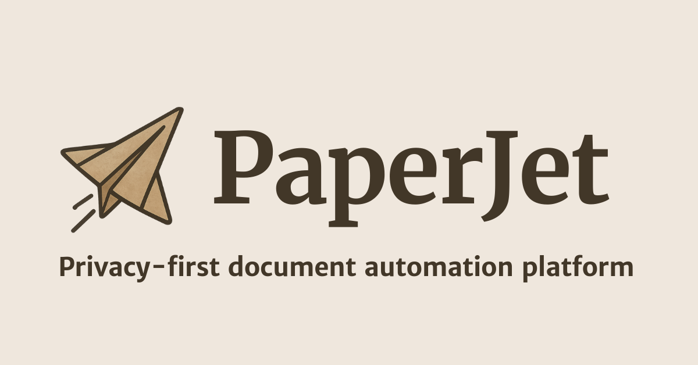

<h1 align="center"><b>PaperJet</b></h1>

    Open-source platform to securely extract data from any document. Build custom workflows while keeping your data private.
     
     
    <a href="https://docs.getpaperjet.com">Docs</a>
    ·
    <a href="https://getpaperjet.com">Website</a>
    ·
    <a href="https://github.com/mlnativeai/paperjet/issues">Issues</a>
  

## About PaperJet

PaperJet is a secure document processing platform. Convert docx, PDF and image files into structured data reliable and on your own hardware. Fully self-hostable with 0 cloud accounts required.

## Features

- Structured data extraction - define a schema and extract it from any supported document (docx, pdf, images)
- Fully open-source - The web and self-hosted versions have the same feature set
- Zero cloud dependencies - PaperJet doesn’t depend on any cloud services. Everything is self-contained in Docker
- Built for large documents: easily ingest hundreds of pages at once
- Use any LLM with your own keys (BYOK)
- supports major cloud providers like OpenAI and Gemini
- local providers: VLLM, LM Studio and Ollama

## Getting started

See [User guide](https://docs.getpaperjet.com) 

## Deployment

See [Administrator guide](https://docs.getpaperjet.com) 

## Repo Activity

## License

This project is licensed under the **[AGPL-3.0](https://opensource.org/licenses/AGPL-3.0)** for non-commercial use.

### Commercial Use

Please contact us for a commercial license at [contact@getpaperjet.com](mailto:contact@getpaperjet.com).

By using this software, you agree to the terms of the license.
